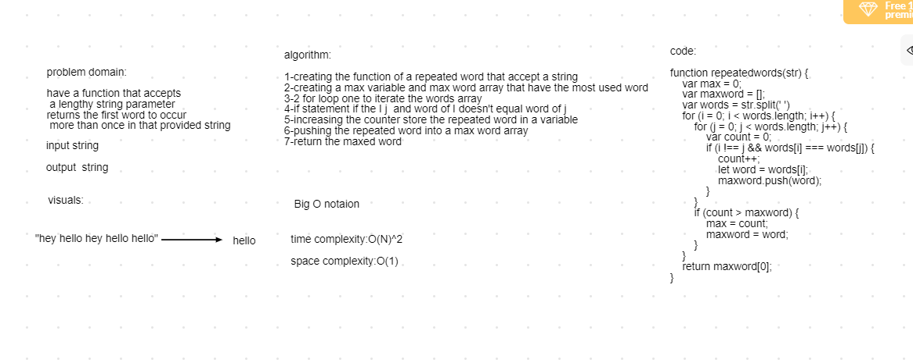

# insertion sort
## Challenge

 challenge is to have a function that accepts a lengthy string parameter return the first word to occur more than once in that provided string

 
## Approach & Efficiency
1-creating an  repeatedwords function that accept an string
2-creating a max variable and maxword array that have the most used word
3-2 for loop one to iterate the words array
4-if statment if the i ! j  and word of i doesnt equal word of j
5-increasing the counter store the repeated word in a variable 
6-pushing the repated word into an maxword array
7-return the maxed word

## BIG O:
time:O(N2)
space:O(n)

## Solution

