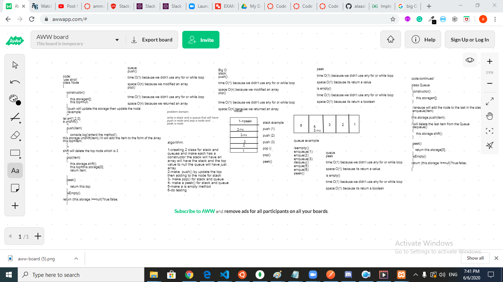

# Reverse an Array
## Challenge

challange to have a stack and queue that will push a node and pop a node and see the top node using peek 

- [submission PR](https://github.com/alaaalmasri12/401-data-structures-and-algorithms/pull/14/)
## Approach & Efficiency

## Solution

