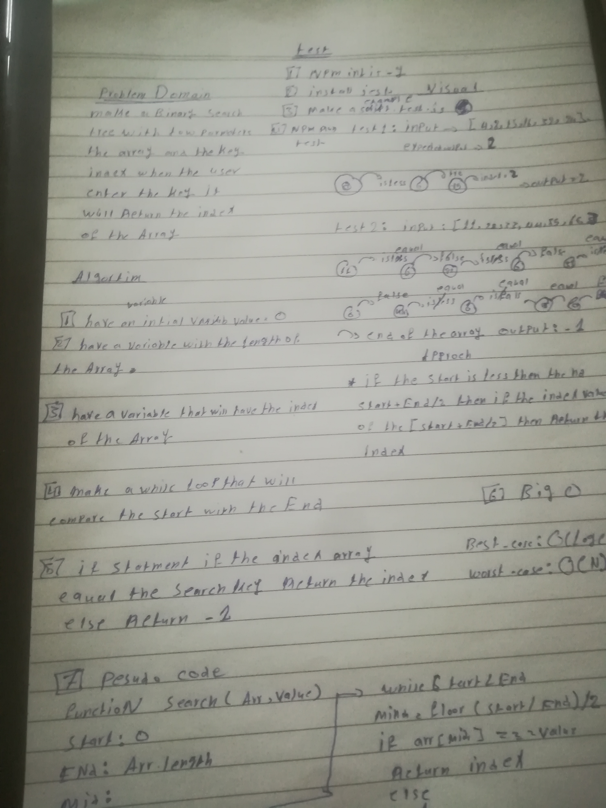

# Reverse an Array
## Challenge

challange to have a binary search tree with the search key that the user enter 
### links
workflow action(https://github.com/alaaalmasri12/401-data-structures-and-algorithms/actions/runs/109629784)
## Approach & Efficiency
1-using a while loop to compare the if the start of the array is less than the length of the array
2-find search key by summing the start with end and divided by 2
3- return index if the right seatch key other wise return -1;
## Solution

