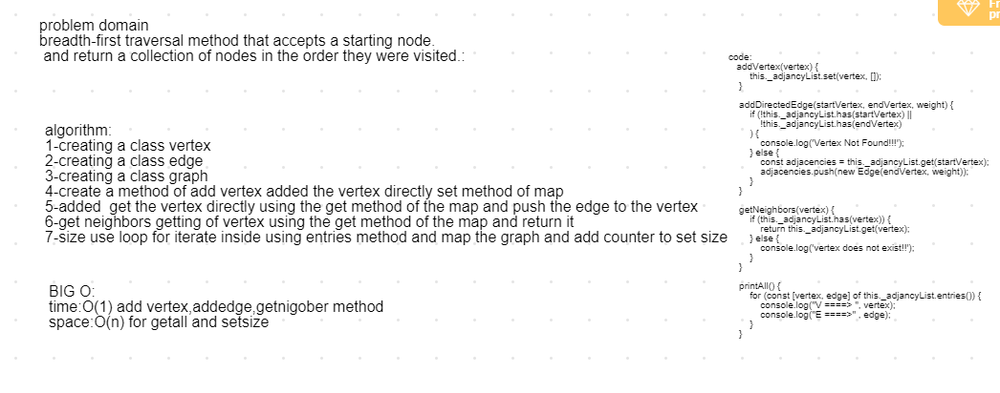

# insertion sort
## Challenge
breadth-first traversal method that accepts a starting node. Without utilizing any of the built-in methods available to your language, return a collection of nodes in the order they were visited.
## Approach & Efficiency
1-creating a class vertex
2-creating a class edge 
3-createing a class graph
4-create a method of addvertex added the vertex dirctly set method of map
5-addedge  get the vertex dirctly using the get mehod of map and push the edgeg to the vertex
6-get neighobors getnig of vertex using get method of map and return it
7-size use loop for iterate inside using entries method and map the graph and add counter to set size

## BIG O:
time:O(1) add vertex,addedge,getnigober method
space:O(n) for getall and setsize

## Solution

