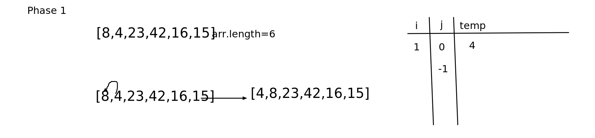
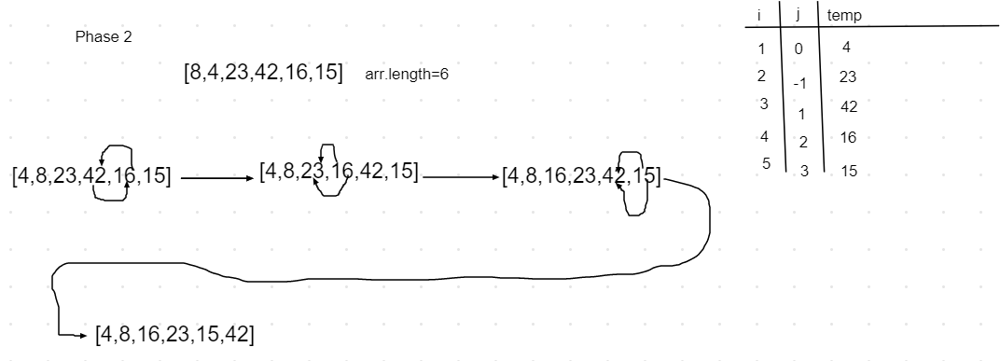

# insertion sort
## Challenge

the challenge is to make insertion function  that will insert array elements and sort it from lowest to heighest
## Approach & Efficiency
1-creating an  insertionsort function that accept an array
2-creating a for loop that will iterate over the array 
3-defining  j variable equal to i-1
4-defining temp variable equal to the index of array of i
5-while loop if j is less than 0 and temp less than array index of j
6-having an array of index j+1 =to the array of index i
7-decreasing j by 1
8-swaping array of index j+1 by the temp which arr of index i
0-returning the array

## BIG O:
time:O(N2)
space:O(n)

## Solution

