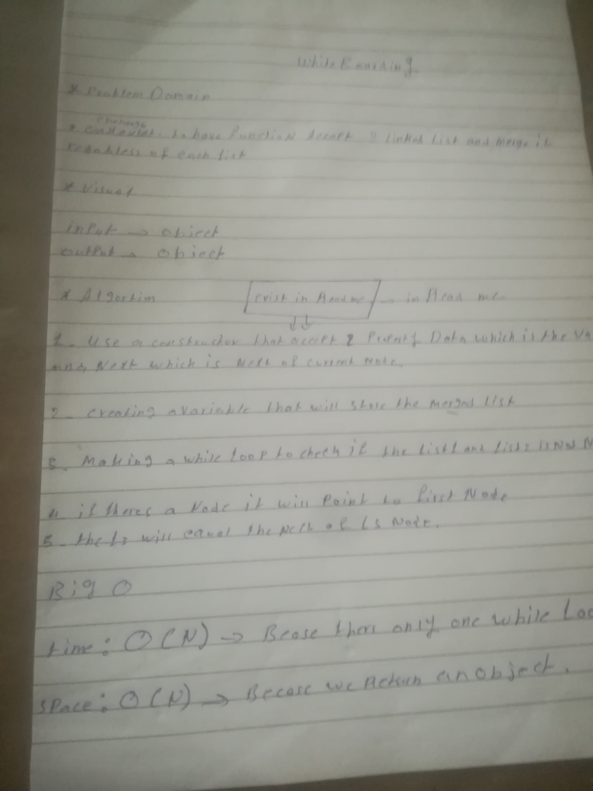

#merge
## Challenge

challange to have a function that accept 2 linked list and megere it one linked list regadless the length of each list

## Approach & Efficiency
1-using a constructor that accept data that is the value of the node and a next which will take the next  of the curent node
2-creating a list called l3 that will store the merged list that will begin with value of null and next is null 
3-making a while loop that check if the list 1 and list 2 is not null 
4- if theres nodes in list 1   the l3 node will point to the first node ;
5-then the first list will point to the next of th current node
6-have the next of the l3 node
7-the same concept with steps from 1-7 except you use anohter list
8-return the combined list  
## Solution

