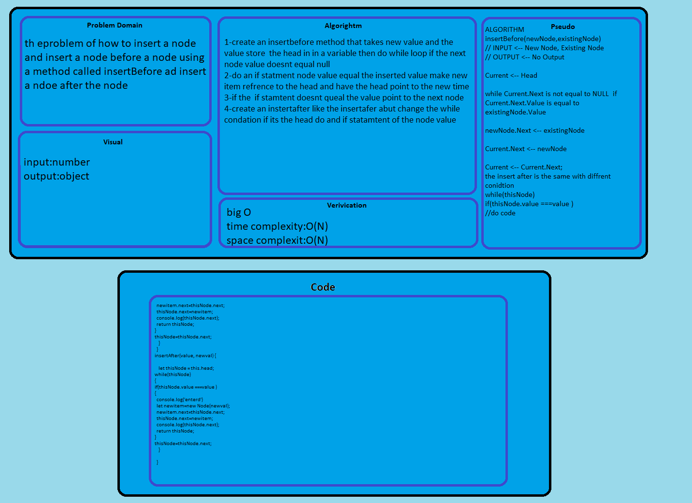

# Linked list challenge
## Challenge

challange to to insert a node and insert a node before and after a spesfic node 

## Approach & Efficiency
1- remove unnecessary code or code that goes to redundant processing
2-To make use of optimal memory and storage
3-To ensure the best speed or run time for completing the algorithm
4-To make use of reusable components wherever possible
5-To make use of error and exception handling at all layers of software, such as the user interface, logic and data flow
6-To create programming code that ensures data integrity and consistency
7-To develop programming code that's compliant with the design logic and flow

## Solution

