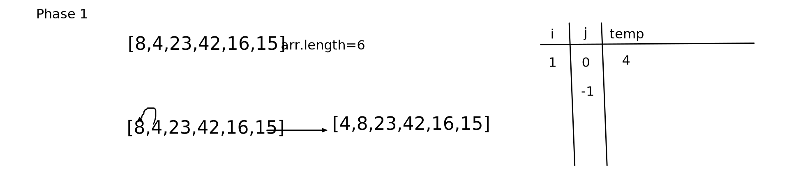

# Quick sort

## Challeng
the challenge is to make a quck sort function  that will  quickly sort data items by dividing a large array into two smaller arrays.

## BIG O:
time:O(N)
space:O(N)

## Solution

