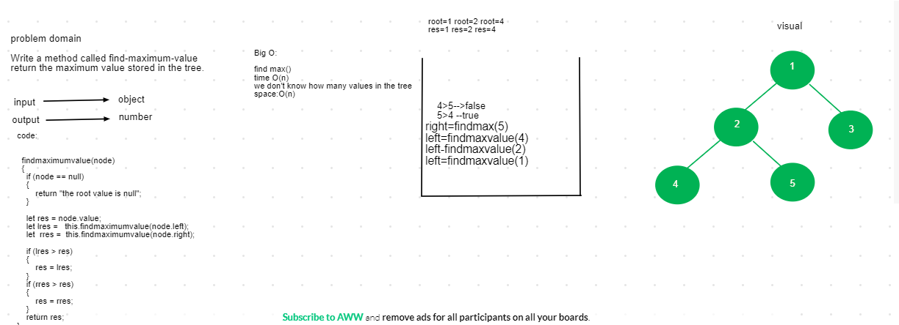

# find-maximum-value
## Challenge

the challenge is to make breadthFirstTraversal in tree data structures
## Approach & Efficiency

we use recursive  to search for left and right tree make if condition if the one of the values from right and left is larger then the max is either left or the right

## Solution

