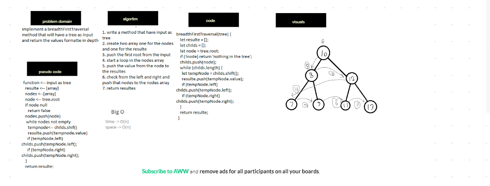

# Reverse an Array
## Challenge

the challenge is to make breadthFirstTraversal in tree data structures
## Approach & Efficiency

we use while loop in the childes cause we push to the array and want to check from its empty space -> O(n) time -> Θ(n)

## Solution

