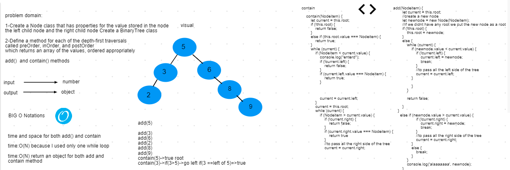

# Reverse an Array
## Challenge

1-Create a Node class that has properties for the value stored in the node
the left child node and the right child node Create a BinaryTree class

2-Define a method for each of the depth-first traversals
called preOrder, inOrder, and postOrder 
which returns an array of the values, ordered appropriately

- [submission PR](https://github.com/alaaalmasri12/401-data-structures-and-algorithms/pull/14/)
## Approach & Efficiency
1-if its the first node it will be the root 
2-if the second node entred is larger than the cureent node it will go right and it  will have the right with that inserted value otherwise if its less it will go left
3- the node that is inserted uses breadth-first which means will search for all the trees it will go to the entier left and right until it reach a leaf

## Solution

